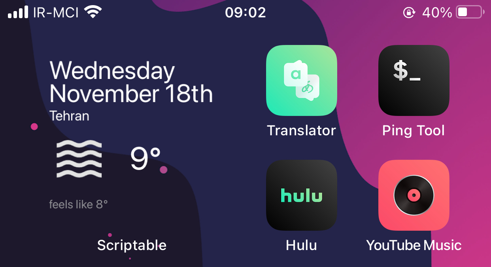

# HomeWeatherNow

    

A simple small/medium/large widget for weather, date, location with transparent background.
Check screenshot for more info.

Don't change anything in Transparent Script.

Guideance: Put your API code from openweathermap.org, also put your location info (Lat, Lot).

